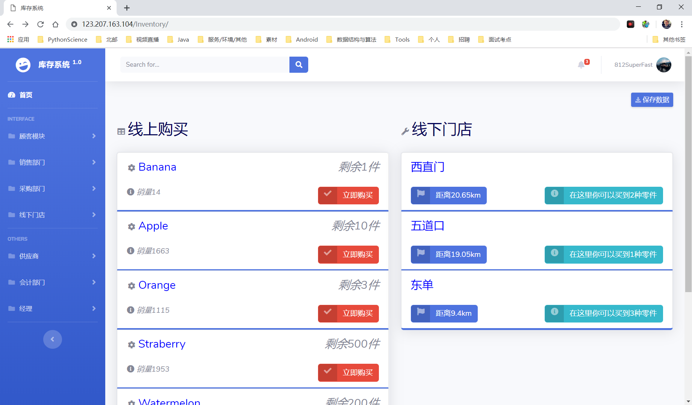

# InventorySys

## 进销存管理系统

## 体验地址
[——>>戳这里](http://123.207.163.104/Inventory/)
预览

## 主要模块

1. 顾客模块
	- 下单（付款-->通知会计部门）
	- 直接下单、物流渠道
    - 通过门店下单、自取  
    - 流水入账-->通知会计部门 
    - 查询订单状态
	- 提货（门店、物流）
	- 改变订单状态（已下单，已提货等）

2. 销售部门
  	- 查看库存、修改库存
	- 安排发货（查看门店信息（通知店长）、仓库信息、安排较优的发货地址）
	- 查看订购单
	- 发货、修改订购单状态
	- 查看采购单状态 查询进货情况

3. 会计部门
	- 查看流水
	- 查看报表（实际上报表已经在系统里了）

4. 采购部门
	- 下采购单（决定发货到哪个仓库、流水出账、通知会计部门）
	- 查看采购单状态
	- 提货（增加对应仓库库存）
	- 修改采购单状态
	- 处理库存调拨请求（发货给门店）、减少仓库库存

5. 供应商
	- 查看采购单状态
	- 处理采购单、改变采购单状态

6. 店长
	- 请求库存调拨（库存申请单、数量、种类）
	- 查看申请单状态
	- 验货（若已发货）、增加本店库存
	- 销售、减少该店的库存（线下销售、主动修改库存）

7. 经理
	- 查看报表
	- 查看库存

